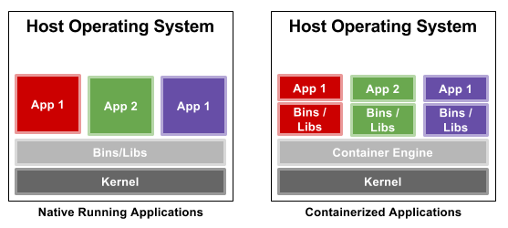

# Linux Container

A simple illustratio of linux containers (LXC) to understand how actual linux containers provides virtualization.

## What are Linux Containers ?

Simply, it is an operating-system-level virtualization method for running multiple Linux systems on a control host using a single Linux kernel.

Containers allow a developer to package up an application with all of the parts it needs, such as libraries and other dependencies, and ship it all out as one package. And they are designed to make it easier to provide a consistent experience as developers and system administrators move code from development environments into production in a fast and replicable way.

Unlike a virtual machine, rather than creating a whole virtual operating system, containers don't need to replicate an entire operating system, only the individual components they need in order to operate. This gives a significant performance boost and reduces the size of the application.

Undoubtedly, one of the biggest reasons for recent interest in container technology has been the Docker open source project, a command line tool that made creating and working with containers easy for developers and sysadmins alike.

To illustrate:

## Linux Container Mechanisms

<h3>namespaces:</h3> are used to group kernel objects into different sets that can be accessed by specific process trees. For example, pid namespaces limit the view of the process list to the processes within the namespace.

<h3>capabilities:</h3> are used here to set some coarse limits on what uid 0 can do.

<h3>cgroups:</h3> is a mechanism to limit usage of resources like memory, disk io, and cpu-time.

<h3>setrlimit:</h3> is another mechanism for limiting resource usage. It's older than cgroups, but can do some things cgroups can't.

## Dependencies

* [libcap](https://man7.org/linux/man-pages/man3/libcap.3.html)
  * <code>sudo apt-get install libcap-dev</code>
* [seccomp](https://man7.org/linux/man-pages/man2/seccomp.2.html)
  * <code>sudo apt-get install -y seccomp & sudo apt-get install libseccomp-dev</code>

## Environment, Compiling and Running

<h3>Environment:</h3>

> Linux Ubuntu 18.04 LTS

<h3>Compile:</h3>

> gcc -Wall -Werror -lcap -lseccomp container.c -o container

<h3>Run:</h3>

This program can be used like this, to run /misc/img/bin/sh in /misc/img as root:

> sudo ./contained -m ~/misc/busybox-img/ -u 0 -c /bin/sh
